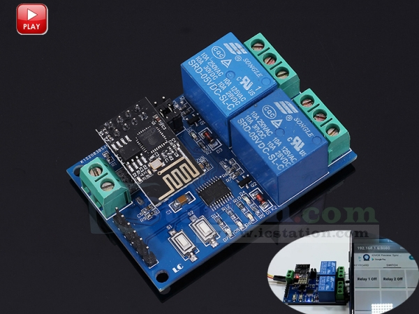

# esp8266-relay
Esp8266 project to control 4 relays in Normally Open mode. It inherited from this [project](https://github.com/lauroro/esp8266-relay).
This is an alternative ESP8266 firmware for the relay board made by LCTech-inc.

# The board
This board is a two-way relay over WiFi in a compact form factor and with a 3.3v onboard regulator to power the ESP8266
Version 1.2 support four-way boards as well.



See http://www.chinalctech.com/cpzx/Programmer/Relay_Module/

- **Pay attention while handling main voltage items**. Don't plug main voltage items while your esp is connected to your PC. Be sure to not touch exposed cables. Don't do anything if you don't know what you're doing please. If you are following this project just to try it don't use main voltage devices at all, just use your relay modules, as they have a built-in led that turns on and off giving you a harmless feedback.

## Libraries used
1. If you use Arduino IDE be sure to [install esp8266 support](https://randomnerdtutorials.com/installing-the-esp32-board-in-arduino-ide-windows-instructions/) first.
2. External libraries (look into each library's readme file to see further dependancies):
    - [Arduino ESP8266 LittleFS Filesystem Uploader](https://github.com/earlephilhower/arduino-esp8266littlefs-plugin)
    - [ESPAsyncWebServer](https://github.com/me-no-dev/ESPAsyncWebServer)

## Project Structure
Using LittleFS uploader you will upload actual html, css and javascript files on the esp8266. As it works under Arduino IDE, just open a new project -> paste the sketch.ino content -> press CTRL+k -> from the project folder create a new folder named "data" -> copy the data folder content of this repo on your data folder. At the end, assuming you are working from a "sketch" folder you will have this situation:
```
sketch/
  |
  ꜔ sketch.ino
  ꜔ data/
      |
      ꜔ index.html
      ꜔ style.css
      ꜔ main.js
      ꜔ on.svg
      ꜔ off.svg
      ꜔ wifimanager.html
```
Follow the LittleFS usage guide to flash the data/ content on the esp filesystem.

## How it works
### Sketch
The _websocket_ functionality from **ESPAsyncWebServer** grants the possibility to efficiently exchange informations between the mcu and all the clients connected to it. It's also used to notify every client about some change of state, and all this in realtime. The esp will connect to wifi (be sure to replace ssid and password so that they match your credentials: once it connects it will print ip address and MAC on the serial monitor, so you can use the ip address to connect to the esp, and MAC address for binding purposes). While running the program will read inputs from the clients and will update it's state. In particular, it will performs some appropriate _digitalWrite_ on the desired pin. Thanks to **LittleFS** we can upload files directly in the esp's filesystem. This grants the possibility to write dedicated html, css, javascript files, but also icons, images, libraries (the space is still very limited by the way).
### data/ files
Inside this folder there is all the necessary for the web-interface. In the file **main.js** it's written the client-side logic. When the DOM is loaded the client sends an http request to the esp to ask for the relays configuration. The response is a string that contains the definition of _divs_, each cointaining some text and _buttons_, one for each relay. This string will be inserted in the html file dinamically hacking into the DOM. Upon a click event on these buttons, a toggle update is sent to the server (the esp) via websocket. Once the server handled the toggle request it will notify every client about the change. Every client will read the notification and will change the appropriate buttons' style accordingly (it will swap the button background image from 'on' to 'of' or viceversa). Here in main.js we also see that the client open a websocket to communicate with the esp (at _"/ws"_). 

